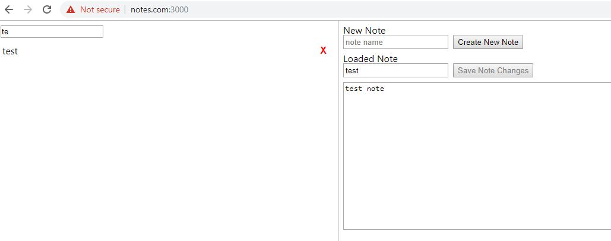

### Current
I just deployed this locally, using a hosts to map to notes.com(note I don't have anything to do with that real domain) I'm just using it for something easy to remember from within own network. Due to having multiple sub-directories couldn't just map to main domain, used a port to serve up that specific directory.

It is a piece of crap no doubt that's why it matters to go deep/all into a project or at least have some sort of plan but I learned a bit.

### Info
This one of those "Why don't you just use Evernote/Trello" sort of things.
Another thing is grouping/collecting all open Chrome tabs/pruning and then saving for future use eg. Chrome extension.
Which again some exist but "mine" eg. code I wrote...
Always that feeling "is it worth it", what is to gain. This is almost an Evernote clone in terms of layout. I feel like nothing I do matters unless it makes money.
My drawing below I forgot a title field of the opened note.

### Functionality
I would like static storage encryption. Another url-based note taking webapp I made eg. [qnote.me](https://qnote.me) uses that with MySQL/PHPDefuse. But this is just a no-auth write thing with a basic interface and faster than url-based.

* CRUD
* search
* tagging

### Deployment
So you would need a way to serve the static stuff once built. And then have a PostgresDB running with Node/Express to handle the API calls. Again this has no auth and very basic validation eg. not empty.

I'm also using Systemd to persist the node backend and this is going on a Raspberry Pi.

### DB Schema
I'm just using default/super user `postgres`

db name: notes

`CREATE DATABASE "notes" WITH OWNER "postgres" ENCODING 'UTF8' LC_COLLATE = 'English_United States' LC_CTYPE = 'English_United States' TEMPLATE = 'template0';`

table: note_entries

**id, name, content, tags, created_at, updated_at**

`CREATE TABLE note_entries (
ID SERIAL PRIMARY KEY,
name VARCHAR(255),
content TEXT,
tags VARCHAR(255),
created_at TIMESTAMP,
updated_at TIMESTAMP
);`

table: note_tags

~~**id, name, created_at, updated_at**
`CREATE TABLE note_tags (
ID SERIAL PRIMARY KEY,
name VARCHAR(255),
created_at TIMESTAMP,
updated_at TIMESTAMP
);`~~

**id, name, note_id, created_at, updated_at**

`CREATE TABLE note_tags (
ID SERIAL PRIMARY KEY,
name VARCHAR(255),
note_entry_id SMALLINT,
created_at TIMESTAMP,
updated_at TIMESTAMP
);`

The tag is a number-to-name deal but the tags in notes would be an array of integers. Well on second thought this concept of GIN-index is new to me, the array of integers would have been for node which doesn't make sense SQL is fastest. I will use the multiple rows method which is slower according to this [link](https://stackoverflow.com/questions/41311191/in-postgres-how-to-match-multiple-tags-for-best-performance).
